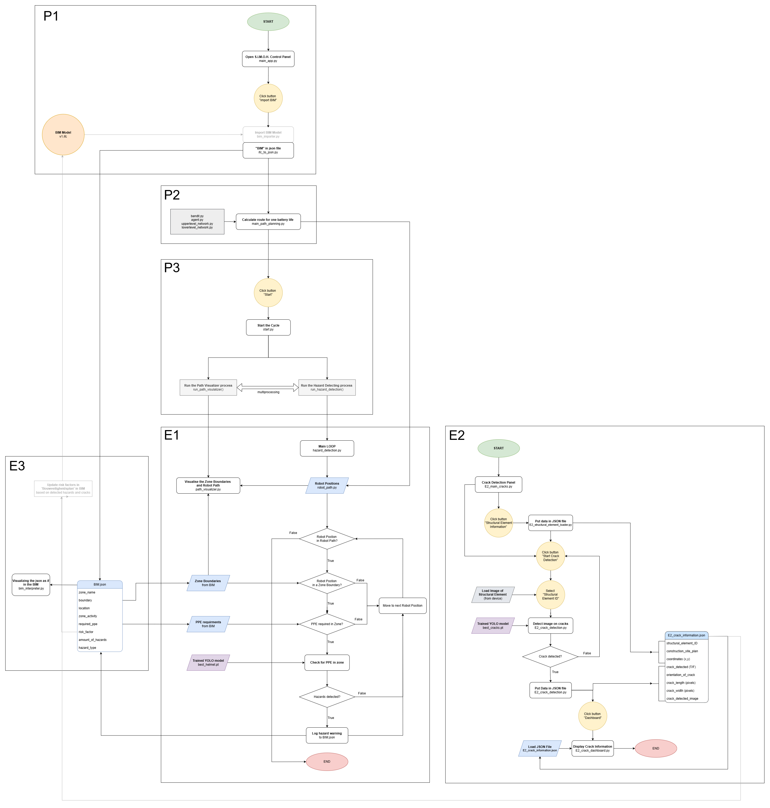

# SIMOH 🤖
S.I.M.O.H. (Site Inspection & Monotoring Of Hazards) 

## Project overview 🧐
This project presents a robotic solution for effective hazard detection and monitoring on construction sites, specifically targeting worker safety- and structural hazards. By using a Unitree Go2 robot equipped with sensors, cameras and a photo recognition script, the system autonomously navigates the site to detect potential hazards in real time. It maps the safety on a construction site by identifying zones with elevated risks and higher amounts of hazards occuring. For structural monitoring, the robot inspects critical building elements, identifying cracks that may indicate structural issues.

The robot utilizes Building Information Modeling (BIM) data to map and plan its route, linking construction activities to specific zones and prioritizing high-risk areas in its schedule. Through continuous data collection and live updates to the BIM model, the system provides site managers with an up-to-date overview of site conditions, enhancing overall safety. This solution minimizes the need for constant human supervision while improving the accuracy and efficiency of hazard detection.

### Features

- 👷‍♂️ PPE (Personal Protective Equipment) detection for workers
- 🧱 Crack detection in structural elements
- 🔎 Autonomous pathplanning and wayfinding 
- 📊 Hazard logging and BIM integration 
- 🧑‍💻 Real-time monotoring


## Repository structure 🏗️
The project folder is organized as follows:

- **assets**: This folder contains all data files the project relies on, including:
   - **BIM file**: An .ifc file representing a Revit model of 'BK City', the TU Delft Faculty of Architecture and the Built Environment.
   - **Trained YOLO models**: Pre-trained deep learning models (Ultralytics YOLOv8), used for classifing helmets and cracks. 
   - **YAML and JSON files**: Configuration and data files the code relies on. JSON files are used for logging hazard warnings and storing the robots precalculated path. 
   - **Other**: Additional files, used for crack detection.

- **modules**: This folder contains the core Python scripts that work together to control the robot. 
   - The scripts are structured based on the phase of the operation:
      - **P (Preperation Phase)**: These scripts handle the initial setup tasks:
         - P1 BIM Loader
         - P2 Pathplanning 
         - P3 Robot Activation
      - **E (Execution Phase)**: These scripts handle the robots real-time operations:
         - E1.1 Wayfinding and Localization
         - E1.2 Hazard Recognition
         - E1.3 Digital Visualization of the path
         - E2 Crack Detection
         - E3 Live BIM interface 
- **test**: This folder contains some testing and training scripts which were used during developing the project. 

- **```main_app_PPE.py```**: This the main script to be run to launch the App for PPE hazard detection.

- **```main_app_cracks.py```**: This is the main script to be run to launch App for crack detection.

Refer to the flowchart below for a visual representation of the different phases and their interactions:

## Project Architecture 🏛️
This flowchart represents the project architecture of the S.I.M.O.H. system, illustrating the phases involved and the interaction between the modules.



### Flowchart Summary
After launching the ```main_app_PPE``` application, the system starts the **Preparation Phase**:
- **P1**: After clicking "Import BIM", an .ifc BIM file is loaded. Zone and structural data is extracted to generate a digital site plan for the robot's path. 
- **P2**: Directly after importing the BIM, the system starts it path planning algorithms. It calculates an optimal route between zones based on factors as risk levels, previously identified hazards, and distances between zones. 
- **P3**: After the robot's plan is finalized and the optimal plan is planned, the Unitree GO2 robot is ready to start the next phase. The "Start" button can be clicked.

When clicking "Start", the **Execution Phase** begins. The robot leaves it charging station and starts its cycle: 
- **E1**: This part is the heart of the system code. It involves the execution of real-time operation, where the robot, simulated by a red dot, navigates its predifined path. When entering the boundary of a zone where a PPE check is required, it opens the systems webcam and starts detecting for PPE. Hazard warnings are logged to the JSON file real-time.
- **E2**: The crack detection algorithm isn't yet integrated within ```main_app_PPE```. It is activated by launching ```main_app_cracks```. The system requests users to locate specific structural elements on a site plan and include a picture of them, which it will then analyze for cracks.
- **E3**: The systems findings are logged directly to the ```BIM.json``` file. Clicking "Show Heatmap" reveals real-time hazard data. 

More elaborate information about all algorithms can be found in the "Final Report PDF". The link to this PDF file: xxxxxxxxxx

## Installation 🚀

Running the code requires a few steps to take. 

### Step 1: Initial Setup
1. **Clone the repository**
   - Clone this repository to your local system:
      ```bash
      git clone https://github.com/tboom-ai/SIMOH.
      ```

2. **Create a Virtual Environment**
   - Creating a new virtual environment is optional but strongly advised:
      ```bash
      python -m venv your_venv
      ```
   - Replace ```your_venv``` with a name of your choice

3. **Set the Python Interpreter Version**
   - Ensure that the virtual environment uses a Python version between **3.8 and 3.12**. This will ensure the code is compatible with all the required packages. The latest Python version, 3.13, isn't yet compatible. 

4. **Activate the Virtual Environment**
   - On **macOS/Linux**:
      ```bash
      source your_venv/bin/activate
      ```
   - On **Windows**:
      ```bash
      your_venv\Scripts\activate
      ```

### Step 2: Installing Dependencies
- Install all necessary packages from the 'requirements.txt' file into your virtual environment:
   ```bash
   pip install -r requirements.txt
   ```

After installing all dependencies, you are al set to launch S.I.M.O.H.'s applications! 🚀

## Usage Instructions 📖

The code included two different applications. 
### Step 3: Running the Application
- To start the **PPE Hazard Detection** application, use the following command:
   ```bash
   python main_app_PPE.py
   ```
- To start the **Crack Detection** application, use the following command:
   ```bash   
   python main_app_cracks.py
   ```

### Potential Issues ⚠️
1. If you encounter issues regarding modules not beeing found, manually install them by running:
   ```bash
   pip install opencv-python ultralytics matplotlib screeninfo numpy ifcopenshell shapely gym networkx pillow
   ```


2. If you encounter the following error, your Python may not be configured for ```tkinter```. 
   ```zsh
   ➜  SIMOH git:(main) ✗ python main_app_PPE.py
   Traceback (most recent call last):
   File "/Users/tombo/Documents/SIMOH/main_app_PPE.py", line 1, in <module>
      import tkinter as tk
   File "/opt/homebrew/Cellar/python@3.11/3.11.3/Frameworks/Python.framework/Versions/3.11/lib/python3.11/tkinter/__init__.py", line 38, in <module>
      import _tkinter 
      ^^^^^^^^^^^^^^^
   ```
- This occasionaly happens when running the code on macOS. You can resolve the issue by installing ```tkinter``` using the following command:
   ```bash
   brew install python-tk
   ```

### Step 4: Running ```main_app_PPE```

The instructions for running this Application are very straightforward. Pay attention to the terminal prompts, since everything expected of the user is detailed there. 

1. Click "Import BIM" button. The first section of the full path will start planning, which may take some time. Eventually, a window pops up showing the smoothed path. Continue closing the windows until the terminal confirms that the full path has been planned. 

*Note: If the planning of a path section takes significant time (>2 minutes), use a keyboard interrupt by pressing **Control + C**. Afterwards, click "Import BIM" again.* 

2. Press "Start" button. Robot path will be animated and the systems webcam will launch. Sit back untill the script finishes. 

3. Press the "Show Heatmap" button to reveal real-time hazard data. Click on a zone's black dot to display detailed hazard data for that specific zone.


### Step 5: Running ```main_app_cracks```


## Acknowledgements 🤩

We would like to thank everyone who contributed to this project:

- **Databases Used**:
   - **[Safety Helmet Detection]**: Used for training the YOLOv8 model ```best_helmet.pt``` on PPE detection. Available on [Kaggle](https://www.kaggle.com/datasets/andrewmvd/hard-hat-detection/data)
   - **[Crack Computer Vision Project]**: Used for training the YOLOv8 model ```best_cracks.pt``` on cracks. Available on [Roboflow](https://universe.roboflow.com/university-bswxt/crack-bphdr?ref=ultralytics)

- **Special Thanks**:
   - **Abdullah Alattas**: For providing us with the BIM ```BK.ifc``` of BK City, the Faculty of Architecture and the Built Environment. 
   - **Prateek Bhustali**: For his guidance on integrating the multi-armed bandit and RRT* algorithms for enhanced pathplanning. Also, many thanks for fixing our GitHub repository in times of hopelessness. 🤝